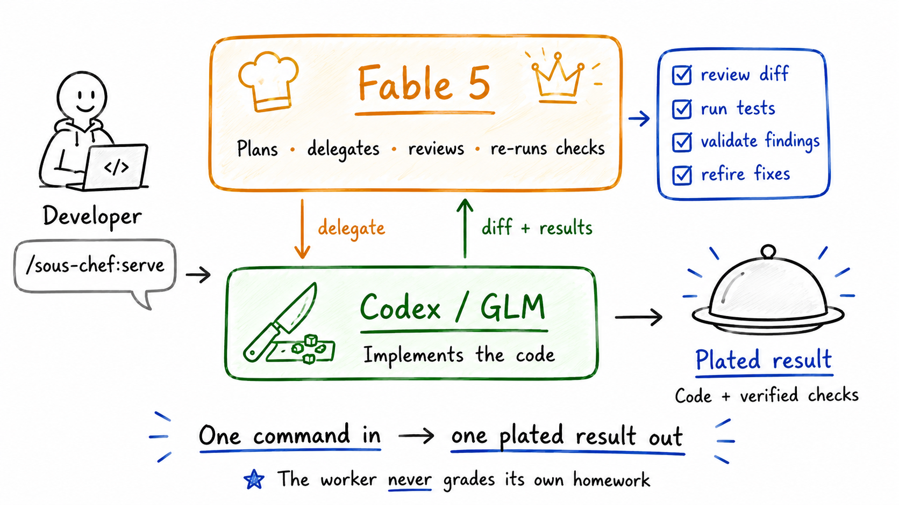

# 🧑‍🍳 sous-chef

  

**Fable 5 orchestrates and reviews; Sonnet 5, GPT-5.5, or GLM 5.2 implements. Your head chef doesn't chop onions.**

A Claude Code plugin that splits coding between two frontier models the way a kitchen
splits work. Fable plans, writes the ticket, reviews every diff line by line, and
re-runs the checks itself. Sonnet, Codex, or GLM does the implementation, with no say
over what ships. The split is economic:
Fable is the most expensive model on the line, so its tokens go to judgment and
worker tokens go to bulk. In the measured setup this pattern is built on,
[Codex did ~20x the implementation work](https://madewithlove.com/blog/claude-up-front-codex-in-the-back/)
per orchestration round trip, and two mid-tier subscriptions often beat one top-tier one.

## What it looks like



Codex saying "tests pass" is a sentence; `pnpm test` output is a fact - Claude
re-runs everything itself.

## Two commands

**`/sous-chef:serve`** is for task-shaped work, done end to end: implement,
cross-review, fix the findings, verify. One announcement up front, one report at the
end, a hard budget of five Codex runs in between. This is the daily driver.

**`/sous-chef:simmer`** is for goal-shaped work, looped until a command passes:
"make the suite green", "get the benchmark under 200ms". A fresh Codex run each lap,
Claude judging every lap with real command output, on a dedicated branch, with lap
caps and no-progress detection. The worker never grades its own homework.

Rule of thumb: **serve a task, simmer a goal.** If a serve runs out of budget and
what remains is goal-shaped, it offers to continue as a simmer.

À la carte, when you want to drive the stations yourself:

| Command | What it does |
|---|---|
| `/sous-chef:fire` | Write the ticket, delegate one implementation run, review the diff against a pre-fire baseline, verify. |
| `/sous-chef:taste` | Cross-model review, read-only. Claude validates every finding against the code and filters false positives before you see them. |
| `/sous-chef:refire` | Turn the confirmed findings from a taste into one scoped fix run, then re-verify each finding at its cited location. |
| `/sous-chef:mise` | Setup: Codex CLI + auth checks, delegation profile, `AGENTS.md` scaffold, routing policy (manual or autonomous). Once per machine, once per repo. |
| `/sous-chef:receipts` | Print the check: the repo's last ten run receipts as a table with a savings total; reprint any receipt's shareable summary. |

## Install

Requirements: [Codex CLI](https://developers.openai.com/codex/cli) ≥ 0.134,
authenticated (`codex login` - a ChatGPT subscription is enough; no API key needed).

```text
/plugin marketplace add tomascupr/sous-chef
/plugin install sous-chef@sous-chef
```

(`sous-chef@sous-chef` is `plugin@marketplace` - same name for both here.) Then,
inside a repo:

```text
/sous-chef:mise
```

`/mise` is idempotent - re-run it anytime as a health check, and after a plugin
update to refresh the installed profile.

## How the split works

```text
you ── "/sous-chef:serve migrate auth" ──▶ CLAUDE (head chef)
                                              │ ticket: files ±, done-when,
                                              │ verification commands
                                              ▼
            ┌────────────────────────────────────────────┐
            │ codex exec --profile sous-chef             │  background;
            │ workspace-write sandbox · approvals off    │  no session memory;
            │ reads AGENTS.md · implements the ticket    │  hard boundary
            └───────────────────┬────────────────────────┘
                                ▼ diff
            CLAUDE reviews + re-runs verification itself
                                ▼
            CODEX reviews read-only, fresh context ──▶ CLAUDE validates findings
                                ▼
            confirmed findings refired once ──▶ verified ──▶ served
```

**Soft routing, not hard blocks.** A routing policy in `CLAUDE.md` plus skills that
make delegation the path of least resistance. Claude still edits directly for small
surgical fixes - hard-blocking Edit/Write provably makes agents route around the
block instead. Manual routing is the default - you trigger the skills, and Claude
offers them when they fit. Autonomous routing lets Claude invoke serve, fire, taste,
and refire itself by task shape, announcing in one line before every delegation;
simmer stays explicit-ask; choose the mode in `/mise`, and switch by re-running it.
The boundary that IS hard: delegated Codex runs execute in a
`workspace-write` sandbox with approvals off, and Codex reviews run `read-only`. (The
optional Claude-worker routes - GLM Route A and Sonnet Route C - have no OS sandbox
underneath; their docs say to treat them accordingly: trusted repos or a
branch/worktree only.)

**One source of truth for standards.** Repo conventions live in `AGENTS.md`, which
Codex re-reads on every run - including non-interactive `codex exec`. Claude reads
the same file via an `@AGENTS.md` import in `CLAUDE.md`. Per-task instructions travel
on the ticket; standing orders stay in the file.

**Background always, polling never.** Delegated runs execute via `run_in_background`
so the Bash timeout ceiling can't kill them mid-job, and completion re-invokes Claude.

**Claims are not evidence.** After every delegated run, Claude reviews the diff line
by line and re-runs the verification commands itself.

## The receipts

Every load-bearing decision traces to a documented incident, an official doc, or a
measured comparison - not vibes. A sample:

- **Why background-always:** a single polling loop against a running Codex job burned
  27% of a weekly Claude quota in ~12 hours producing nothing
  ([anthropics/claude-code#54143](https://github.com/anthropics/claude-code/issues/54143)).
- **Why soft routing, not blocking Edit/Write:** an agent, blocked three times by a
  hook, routed around it with a Python file-write via Bash
  ([anthropics/claude-code#29709](https://github.com/anthropics/claude-code/issues/29709)).
  A hard block that can't hold is worse than an honest routing policy.
- **Why findings get validated:** in a 20-review field test, ~3 of 20 Codex reviews
  failed silently, and adversarial mode flagged missing circuit breakers on a
  500-line cron script.

Full sources for these and every other decision: [docs/design.md](docs/design.md).

## FAQ

**How is this different from OpenAI's official codex plugin?** Three deliberate
divergences, each with receipts in [docs/design.md](docs/design.md): (1) no stop-time
review gate - OpenAI's own README warns it "can create a long-running Claude/Codex
loop and may drain usage limits quickly"; here, review runs inside a pass you
explicitly ordered, under a hard run budget, not on every stop. (2) findings get
validated against the actual code before you see them - raw cross-model reviews
over-flag, and validation filters the false positives. (3) `/simmer` fills a gap
neither the official plugin nor ralph-loop covers: a delegated implementer inside the
loop with an independent judge outside it.

**What does this cost me?** Two subscriptions: any Claude plan for Claude Code, and a
ChatGPT plan for Codex - `codex login`, no API key needed. Subscription auth is the
first-class path for headless runs: `codex exec` reuses the saved login, tokens
auto-refresh even mid-run, and fire unsets the two env vars (`CODEX_API_KEY`,
`CODEX_ACCESS_TOKEN`) that could silently switch a run to per-token billing.
Delegation overhead is ~5-7k Claude tokens per round trip, which is why small tasks
stay with Claude.

**How do I see what I'm saving?** Every delegated run reports the worker's token
count from the job log and appends one JSON line to `~/.sous-chef/ledger.jsonl`.
`/mise` prints the running tab (jobs to date, tokens kept off Claude), or sum it
yourself:
`jq -s '{jobs: length, tokens: (map(.tokens) | add)}' ~/.sous-chef/ledger.jsonl`.
Serves and simmers also drop a per-run receipt in `.sous-chef/receipts/` -
measured tokens, an API-list cost estimate, the diff, the verdict, and a
paste-ready summary. `/sous-chef:receipts` prints the last ten with a savings
total.

**What does delegation actually save?** Measured 2026-07-04: three seeded tasks
(mechanical refactor, mid-size feature, parser-class feature), each run both ways
from a clean clone against identical checkable done-criteria - direct in a fresh
Claude Code session (Fable 5) vs a sous-chef-profile `codex exec` (GPT-5.5, xhigh).
All six runs green. Per task, Claude-side spend fell from 0.78-4.3M tokens
(~$3.8-12.7 at cache-aware API list prices) to the ~5-7k-token orchestration
overhead, with the worker burning 140-361k GPT-5.5 tokens (~$0.27-0.53) - roughly
10-20x cheaper per task in effective API-price terms. Full method, per-task table,
and caveats: [issue #2](../../issues/2).

**What do I see while it cooks?** An announcement first: what was delegated, the
expected duration (typically 5-20+ minutes per Codex run at high reasoning effort),
and the log path. You keep working; Claude is re-invoked when the job exits. In a
serve - or on request in a fire - Claude also posts a one-line progress tick every
few minutes, distilled from the job log, until the run exits. Cancel anytime -
Claude kills the job and shows you any partial changes to keep or revert.

**Does Claude stop writing code?** No. Small fixes, prototypes, and anything
design-ambiguous stay with Claude - the routing rules themselves say so. Delegation
is announced, never silent - in both routing modes.

**Which models?** Whatever your `~/.codex/config.toml` says - the shipped profile
pins only sandbox and approval policy. Recommended: `gpt-5.6-sol` with
`model_reasoning_effort = "high"` (`max` for the hardest tickets); `gpt-5.6-terra`
delivers 5.5-class output at half the price for standard work. Leave 5.6's ultra
mode off for delegated background runs - it multiplies token spend by design, with
nobody watching. GLM-5.2 ships as an opt-in second implementer
("fire with GLM"): it slightly out-benchmarks GPT-5.5 on SWE-bench Pro at a fraction
of the per-token price, though ~3.3x more token-hungry. Two routes as templates
(GLM Coding Plan via a headless Claude worker, or OpenRouter through Codex); `/mise`
sets up whichever key you have. A third route needs no key at all: fire the
ticket to Claude Sonnet 5 headless on your own Anthropic subscription - the
built-in fallback when Codex hits its usage limit mid-serve. On the Claude side
it's model-agnostic; built for and dogfooded with Fable 5.

**Why not MCP?** Plain `codex exec` over Bash gives you the sandbox flag, the exit
code, stdin for prompts, and background execution with no extra moving parts. That is
why sous-chef uses a thin wrapper instead of a persistent MCP server.

**Windows?** The snippets are POSIX; under Claude Code's Git Bash they should work,
but this is dogfooded on macOS.

## What's in the box

```text
skills/serve/         the autonomous pipeline: fire, taste, refire, verify, report
skills/simmer/        the loop: Codex works, Claude judges, until the goal passes
skills/fire/          delegation skill + ticket template + GLM routes
skills/taste/         cross-review skill + review prompt template
skills/refire/        fix skill: confirmed findings become a scoped fix run
skills/mise/          setup skill
skills/receipts/      the check: per-run cost receipts + savings table
codex/                Codex profiles → ~/.codex/ (sous-chef default, sous-chef-glm)
templates/            AGENTS.md scaffold, CLAUDE.md routing blocks (manual + autonomous), GLM worker config
docs/design.md        the receipts: sources for every design decision
```

## Uninstall

`/plugin uninstall sous-chef` removes the skills (and
`/plugin marketplace remove sous-chef` the registration). Using the plugin may also
have created (remove by hand if you're done with them):

- `~/.codex/sous-chef.config.toml` and `~/.codex/sous-chef-glm.config.toml`
- `~/.sous-chef/glm-claude/` (isolated GLM worker config) and
  `~/.sous-chef/ledger.jsonl` (the running tab)
- a "Division of labor (sous-chef, ...)" routing block (manual or autonomous variant)
  appended to `~/.claude/CLAUDE.md`
- an `AGENTS.md` scaffold and/or `@AGENTS.md` import line in repos you set up (these
  are yours now - they're useful regardless of the plugin)
- a `.sous-chef/` directory (run receipts, and loop state after a simmer) in repos
  where a serve or simmer ran - git-ignored via a `.sous-chef/` line in
  `.git/info/exclude`; `rm -rf .sous-chef` per repo when you're done with the
  receipts

## Contributing

Field reports welcome - especially Windows, and especially receipts that contradict
[docs/design.md](docs/design.md); it's meant to be corrected.

## License

MIT © Tomas Cupr
